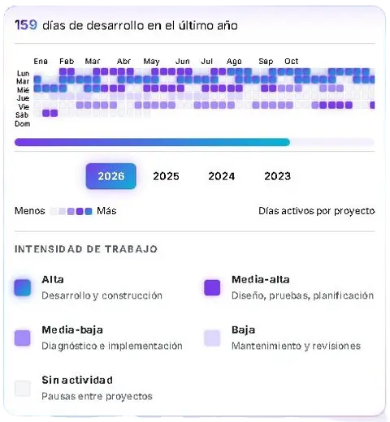

 

  

  

 

  

---

##  Sobre mí

 

**Ingeniera en Informática** con +3 años como **Analista de Sistemas & Full Stack Developer**. Combino la visión analítica del análisis con la ejecución técnica del desarrollo completo.

- 🧠 Pienso antes de programar
- 📝 Documento lo que construyo
- 🎨 Diseño interfaces que invitan a usarse
- 🤝 Entrego lo que prometo

---

## 🛠️ Stack Tecnológico

### 🎨 Frontend & UI/UX

### ⚙️ Backend & Bases de Datos

### 🛠️ Herramientas & DevOps

### 🔐 Arquitectura & Seguridad

  
  
  
  
  
  
  

### 🤖 IA & Machine Learning

  
  
  
  

### 📊 Metodologías & Testing

  
  
  
  
  
  

---

## 📈 Mi Actividad de Desarrollo

**📈 Resumen de Trayectoria Profesional**

 

### 📊 Gráfico de Contribuciones

 

### 📋 Historial de Desarrollo por Proyecto

<table align="center">
  <thead>
    <tr>
      <th align="center">🚀 Proyecto</th>
      <th align="center">📅 Período</th>
      <th align="center">🔄 Metodología</th>
      <th align="center">🟪 Intensidad</th>
      <th align="center">📊 Actividad</th>
    </tr>
  </thead>
  <tbody>
    <tr>
      <td align="center"><b>SIEP</b> Papelería ISA&CRIS</td>
      <td align="center"><code>Ene 2023 Ago 2024</code></td>
      <td align="center">Cascada secuencial</td>
      <td align="center">
        
      </td>
      <td align="center">
         
         
        
      </td>
    </tr>
    <tr>
      <td align="center"><b>SIGENOR</b> U.E. Nocturna Br. Rafael Rangel</td>
      <td align="center"><code>Oct 2024 Jun 2025</code></td>
      <td align="center">Waterfall</td>
      <td align="center">
        
      </td>
      <td align="center">
         
         
        
      </td>
    </tr>
    <tr>
      <td align="center"><b>SIGPAZ</b> Justicia de Paz Comunal</td>
      <td align="center"><code>Jul 2025 Jun 2026</code></td>
      <td align="center">FDD · 12 Sprints</td>
      <td align="center">
        
      </td>
      <td align="center">
         
         
        
      </td>
    </tr>
    <tr>
      <td align="center"><b>Nuevo Desarrollo</b> En curso</td>
      <td align="center"><code>Ago 2026 Hoy</code></td>
      <td align="center">En definición</td>
      <td align="center">
        
      </td>
      <td align="center">
         
        
      </td>
    </tr>
  </tbody>
</table>

---

## 🚀 Proyectos Destacados

| 🚀 Proyecto | 📝 Descripción | 🛠️ Stack |
|:-----------:|:---------------|:--------:|
| **SIGPAZ** | Sistema de justicia comunitaria con IA generativa | Laravel \| Angular \| PostgreSQL \| RAG |
| **SIGENOR** | Sistema de gestión académica institucional | PHP \| MySQL \| JavaScript \| FPDF |
| **SIEP** | E-commerce con panel administrativo | PHP \| MySQL \| jQuery \| TCPDF |
| **Project Celestia** | Visor técnico de sprites PNG con Three.js | Three.js \| WebGL \| ES6 |

---

## 💼 Experiencia Profesional

<b>🏛️ SIGPAZ | Módulo de Justicia de Paz Comunal</b>

 

**Analista de Sistemas & Full Stack Developer** | `07/2025 – 07/2026`
*Liderazgo de equipo de 6 personas | Metodología FDD*

- 🏗️ Arquitectura Backend con SOLID, GoF, Service Layer y Repository (Laravel)
- 🎨 Frontend SPA con Angular (RxJS, Lazy Loading, WebSockets) + Three.js
- 🔐 Seguridad Zero-Trust: JWT, MFA, RBAC, AES-256, auditoría con Observer
- 🤖 IA Generativa: Pipeline RAG (pgvector) + asistente NLP/NLU
- 🗄️ Base de datos 3FN + ACID + integración cloud (Supabase, Backblaze B2)

**Resultados:** `CSAT 95.71%` | `SUS 82.5/100` | `ROI 819.088%`

<b>🎓 SIGENOR | U.E. Nocturna Br. Rafael Rangel</b>

 

**Analista de Sistemas & Full Stack Developer** | `2024 – 2025`
*Liderazgo de equipo de 6 personas | Metodología Waterfall*

- 🏗️ Sistema académico con arquitectura MVC en PHP y MySQL
- 🗄️ Base de datos normalizada en 3FN con propiedades ACID
- 📄 Motor de reportes y boletines en PDF (FPDF)

**Resultados:** `-70% tiempo admin` | `-85% errores humanos` | `100% reportes auto`

<b>📚 SIEP | Papelería ISA&CRIS</b>

 

**Analista de Sistemas & Full Stack Developer** | `2023 – 2024`
*Liderazgo de equipo de 7 personas | Metodología XP*

- 🏗️ Plataforma E-commerce (MVP) con MVC en PHP, MySQL, Ajax, JS
- 💼 Módulos de Supply Chain, Ventas y Cálculo de IVA
- 🖨️ Panel admin con códigos de barras (TCPDF)

**Resultados:** `100% automatización de inventario y ventas`

---

## 📜 Certificaciones

### 🎓 Formación Académica & Desarrollo

| 🏆 Certificación | 🏛️ Institución | 📅 Año |
|:-----------------|:---------------:|:------:|
| Desarrolladora de Aplicaciones | **UPTMA** | 2026 |
| Soporte Técnico a Usuarios y Equipos | **UPTMA** | 2026 |
| Backend usando PHP y MySQL | **Cursa** | 2024 |
| PHP Tutoriales con Jonmirca | **Cursa** | 2024 |
| Introducción a JavaScript | **SoloLearn** | 2024 |

### ☁️ Cloud & DevOps

| 🏆 Certificación | 🏛️ Institución | 📅 Año |
|:-----------------|:---------------:|:------:|
| Fundamentos de AWS: Cloud, Serverless y Operación | **Commit Academy** | 2026 |

### 🔐 Ciberseguridad & Forense

| 🏆 Certificación | 🏛️ Institución | 📅 Año |
|:-----------------|:---------------:|:------:|
| Ciberseguridad y Hacking Ético | **BIG School** | 2026 |
| Fundamentos Básicos de la Informática Forense | **SUSCERTE** | 2026 |

### 🤖 IA, Data & Analytics

| 🏆 Certificación | 🏛️ Institución | 📅 Año |
|:-----------------|:---------------:|:------:|
| IA: De 0 a Agentes | **BIG School** | 2026 |
| Desarrollo con IA: De 0 a Producción | **BIG School** | 2026 |
| Data Science con IA | **BIG School** | 2026 |
| Acelerador de Carrera con Power BI + IA | **DAXUS** | 2026 |

**🎯 Total: 12 certificaciones profesionales | 6 instituciones | 4 áreas técnicas**

---

## 🎓 Educación

| 🏛️ Institución | 📚 Título | 📅 Año | 🏆 Logro |
|:--------------:|:--------:|:------:|:--------:|
| **UPTMA** | Ingeniería en Informática | 2018 – 2026 | GPA 3.6/4.0 \| Honores |
| **UPTMA** | TSU en Informática | 2018 – 2024 | Primer lugar |

---

## 🌐 Idiomas

| 🗣️ Idioma | 📊 Nivel | 🎯 Uso |
|:---------:|:--------:|:------:|
| 🇪🇸 **Español** | Nativo | Comunicación profesional completa |
| 🇬🇧 **Inglés** | Competencia Básica Profesional | Lectura técnica y comprensión |

---

## 💭 Mi Filosofía

> *"Arquitecturas sólidas con interfaces que invitan a usarlas."*
>
> **— Andrea López**

---

## 🤝 Conectemos

  

---

© 2026 Andrea López | Hecho con 💜 y mucho ☕

